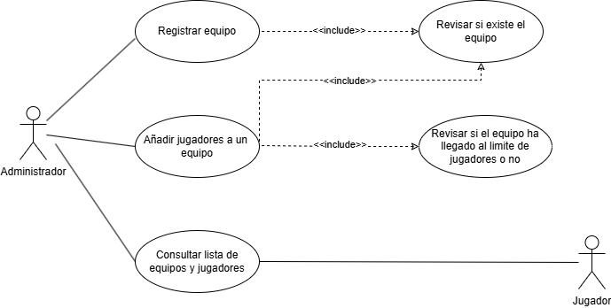
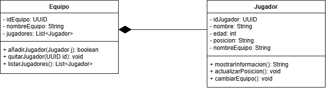

# torneo-esports-uml

## <u>Autor</u>:
Axel Soubielle Almada

## 1. Analisis del problema y requisitos
- <u>¿Quiénes son los actores que interactúan con el sistema?</u>
<b> Los actores en este caso serán son los administradores y los jugadores. </b>    

- <u>¿Cuáles son las acciones que cada actor puede realizar? </u> 
<b> Los administradores pueden crear equipos, crear y editar jugadores. Tanto los administradores como los jugadores pueden ver un listado de los equipos con sus jugadores    
- <u>¿Cómo se relacionan entre sí las entidades del sistema? </u>\
<b> Los jugadores forman parte de los equipos. No pueden existir jugadores sin equipos. </b>    

## 2. Identificación de los casos de uso y elaboración del diagrama

* <u>Gestión de Equipos y Jugadores:</u>
  - Registrar equipo
  - Añadir jugador a un equipo
  - Consultar lista de equipos y jugadores

## 3. Diagramas UML
### Diagrama de Casos de Uso

### Diagrama de Clases
